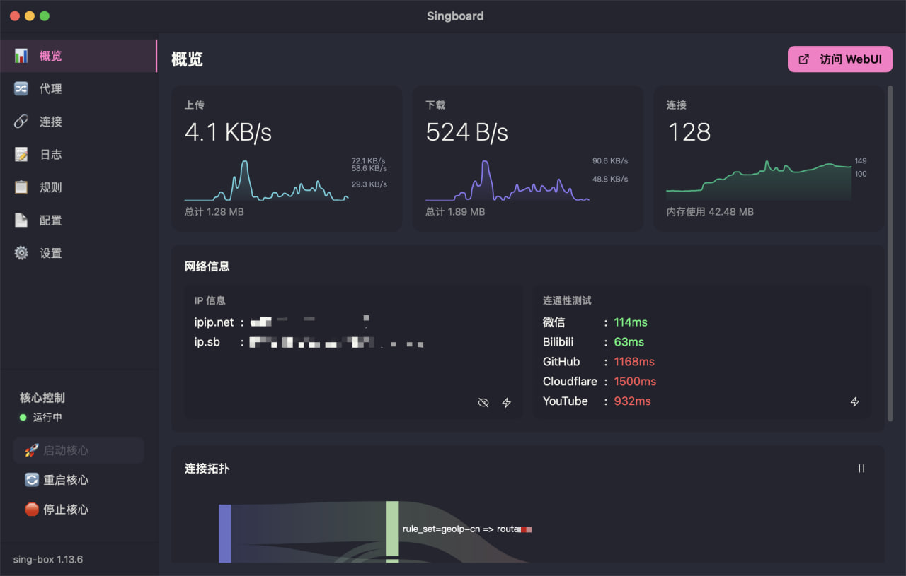

# Singboard for macOS

A macOS adaptation of **Singboard**, a lightweight launcher for `sing-box`.

> Credits to the original author for the excellent open-source project.

------

## ✨ Features

- Native macOS adaptation
- Privileged **SMJobBless Helper** (root-level execution)
- Supports **TUN inbound** and system proxy control
- Multiple themes (dark + light + others)
- Consistent behavior with the Windows version

<p>
  
  
  
  
</p>

## ⚠️ Updating

If you're upgrading from an existing installation:

1. Click **【停止核心】**
2. Go to Settings → **【卸载服务】**
3. Quit Singboard from the menu bar (fully exit)
4. Replace `singboard.app` in **Applications**

> This project is relatively stable and may not receive frequent updates.
> You only need to keep your `sing-box` core up to date.

------

## 🚀 Getting Started

### 1. Prepare `sing-box`

Download the latest release:
https://github.com/SagerNet/sing-box/releases

Choose the correct build:

- **Apple Silicon**: `darwin-arm64`
- **Intel**: `darwin-amd64` (legacy optional, untested)

Extract and:

- Rename binary to `sing-box`
- Place it in your working directory (same as `config.json`)

> `chmod +x` is usually not required.

------

### 2. Required Configuration

Your config **must include** `clash_api` under `experimental`:

```json
"clash_api": {
  "external_controller": "127.0.0.1:9090",
  "external_ui": "ui",
  "external_ui_download_url": "https://github.com/Zephyruso/zashboard/archive/gh-pages.zip",
  "secret": ""
}
```

------

### 3. First Launch (Gatekeeper)

macOS may block the app initially:

- Go to **System Settings → Privacy & Security**
- Click **Allow Anyway**

------

## 🔐 Permissions & Architecture

Singboard uses a **privileged Helper (SMJobBless)**:

- Runs `sing-box` as **root**
- Installed to `/Library/PrivilegedHelperTools/`
- Managed via `launchd` (LaunchDaemon)
- Requires **admin password once** (first install only)

### TUN & DNS Handling

Due to macOS DNS priority limitations:

- TUN alone cannot capture all DNS traffic
- Singboard temporarily rewrites system DNS → TUN interface
- DNS is restored when stopping the core

> This approach may be affected by network changes and is not 100% stable.

------

## 🔄 macOS vs Windows

| Feature        | Windows     | macOS                             |
| -------------- | ----------- | --------------------------------- |
| Service        | SCM         | SMJobBless + LaunchDaemon         |
| Privilege      | SYSTEM      | root (Helper)                     |
| IPC            | —           | Unix Socket                       |
| Auto Start     | SCM         | launchd KeepAlive                 |
| Config Storage | Registry    | `~/Library/.../params.json`       |
| Logs           | Local files | + `/var/log/singboard-helper.log` |

> Core logic remains identical across platforms.

------

## 🛠 Build

```bash
pnpm install
pnpm tauri dev

# Release
pnpm tauri build --target aarch64-apple-darwin
pnpm tauri build --target x86_64-apple-darwin
```

### Requirements

- Rust → https://rustup.rs/

- Node.js → https://nodejs.org/

- Tauri CLI:

  ```bash
  cargo install tauri-cli
  ```

> The `singboard-helper` binary is built and bundled automatically.

------

## 📁 Project Structure

```
src-tauri/
├── service/scm.rs        # SMJobBless IPC client (replaces Windows SCM)
├── commands/service.rs   # Helper management commands
├── commands/network.rs   # macOS proxy handling
└── ...

helper/
├── ipc_server.rs         # Unix socket server
├── process_mgr.rs        # Root process management
└── ...
```

------

## ⚠️ Notes

- This is a **launcher**, not a core replacement
- You must manage your own `sing-box` binary
- TUN + DNS workaround is a **best-effort solution**

------

## 🙏 Acknowledgements

- Original Singboard author
- `sing-box` project contributors
